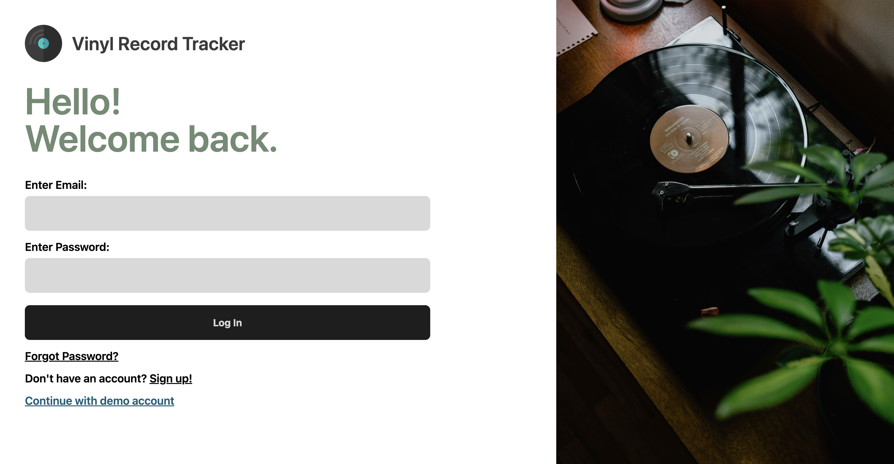
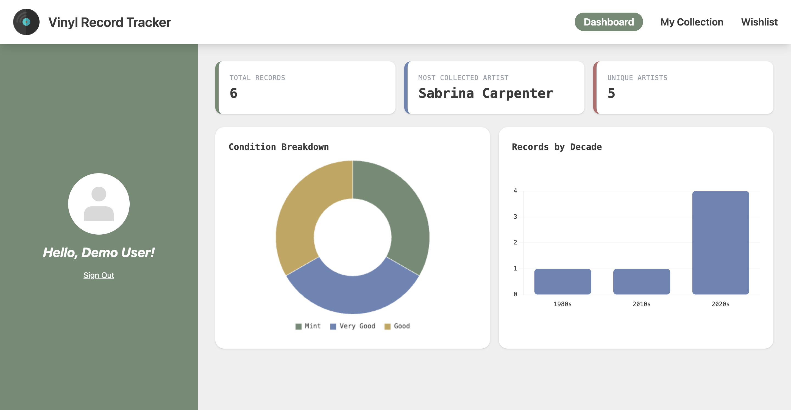
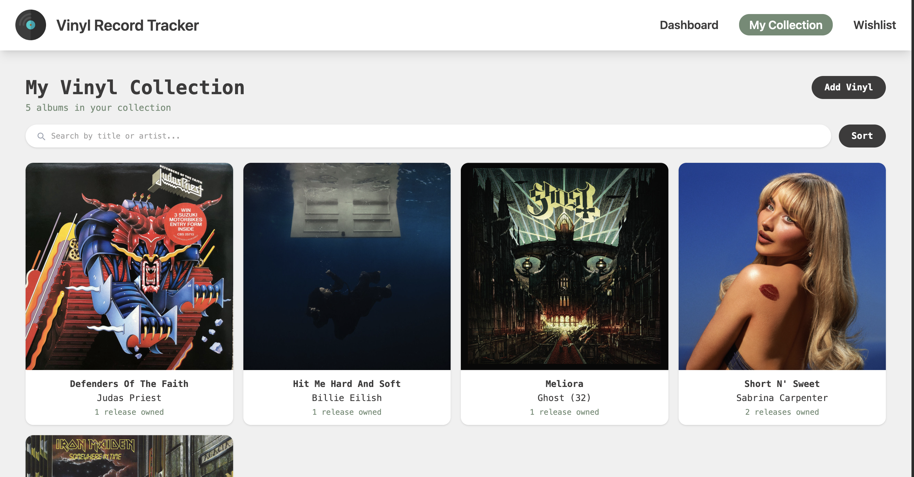
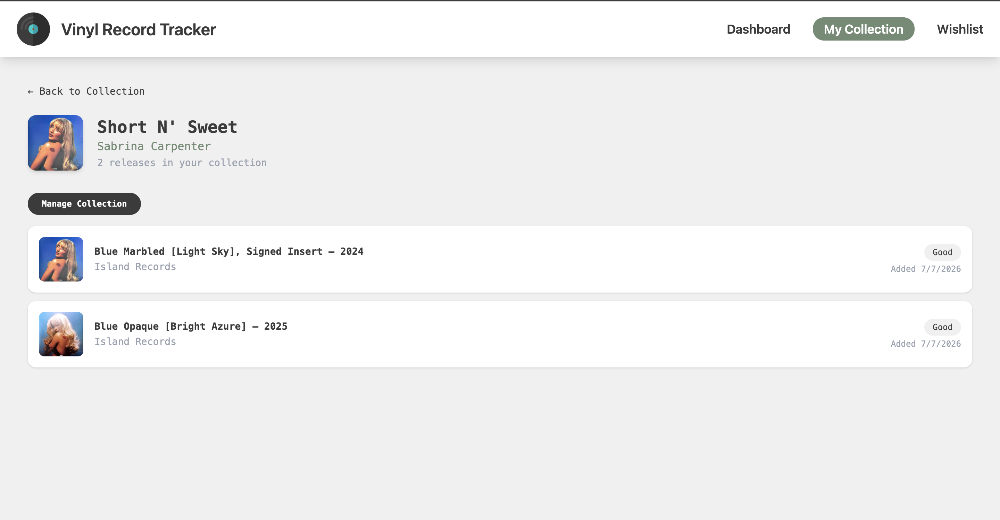
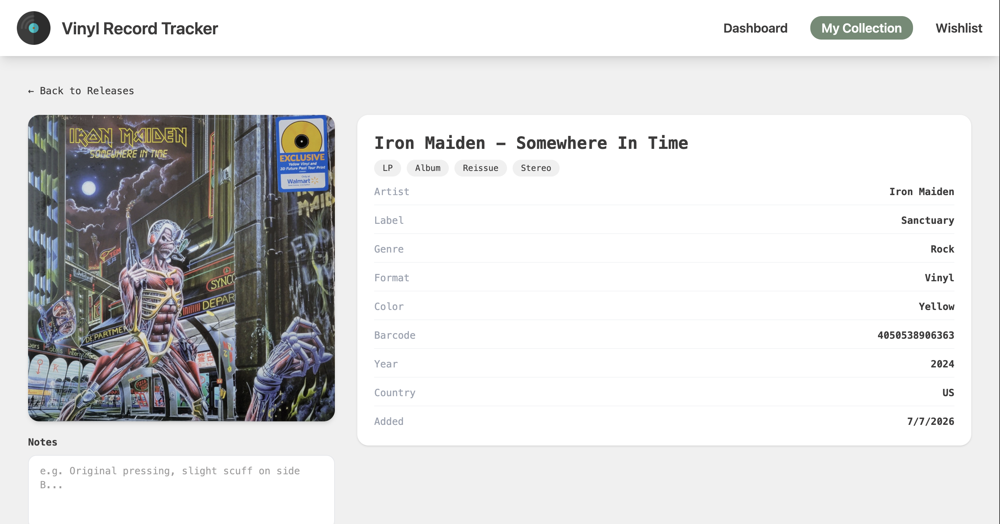

# Vinyl Record Collection Tracker

A full-stack web application for tracking your vinyl record collection and wishlist built to demonstrate a project with CRUD functionalities, authentication and authorization handling, external data integration, relational database usage, deployment, and system design. And also for personal use!

## Website Link

[Website Link](https://vinyl-record-tracker.com/) | [Frontend Repo](https://github.com/avalos-eduardo/vinyl-record-tracker-frontend) | [Backend Repo](https://github.com/avalos-eduardo/vinyl-record-tracker) |

Try it out instantly with the read-only demo account!

## Tech Stack

- **Frontend:** React, TypeScript, Vite, Tailwind CSS, React Router, Chart.js, react-hot-toast
- **Backend:** Java, Spring Boot, Spring Security, Hibernate / JPA
- **Database:** PostgreSQL
- **Deployment:** Cloudflare Pages (Frontend), Railway (Backend & PostgreSQL)
- **External Integrations:** Discogs API for vinyl record data & Resend for sending emails

## Features

- **Live catalog search** via the Discogs API — search by title or artist, browse paginated results with format, label, and vinyl color shown inline
- **Collection & Wishlist**, sharing the same underlying data model — move an item from wishlist to collection with one click
- **Master → Release → Copy hierarchy** — the collection page groups by album; drilling in shows every pressing you own of that album
- **Editable condition & notes** per copy, updatable at any time
- **Dashboard statistics** — total records, most collected artist, unique artists, condition breakdown, and records-by-decade, visualized with Chart.js
- **Stateless JWT authentication** alongside a public read-only demo account (mutating actions are blocked server-side and surfaced with clear toast messaging)
- **Password Resets** offered through the use of temporary reset tokens and automatic emails powerered by Resend
- **Responsive design** — full functionality from mobile through desktop

## Screenshots

---
